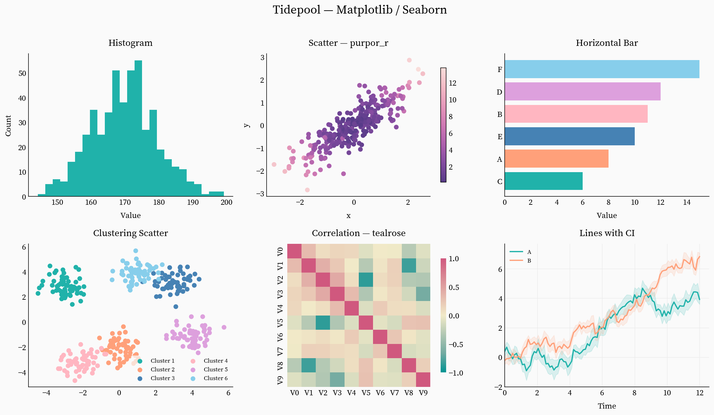
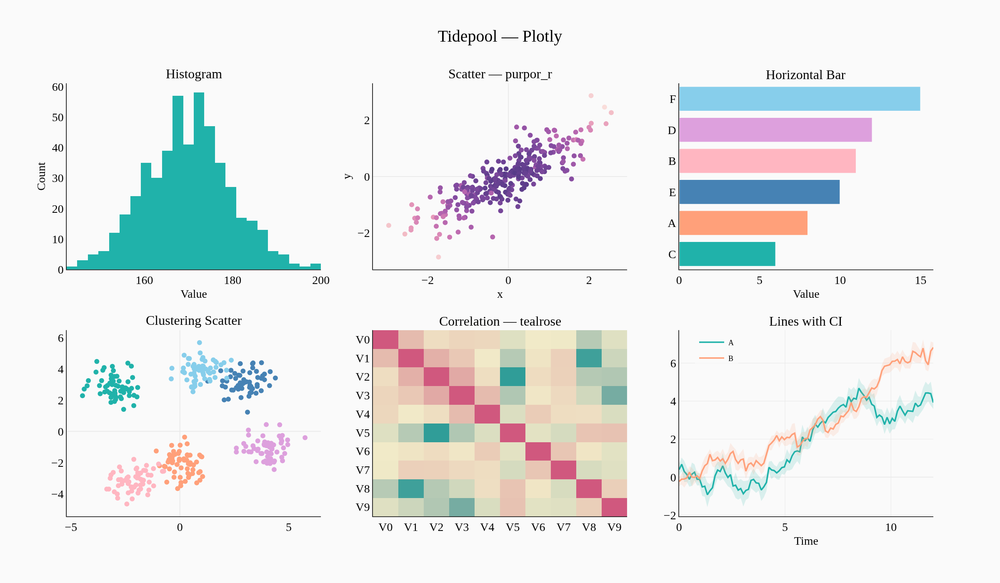

# tidepool

A light, minimal plotting theme with soft coastal colors and serif (or sans) typography.
Available for both **matplotlib/seaborn** and **plotly**.

## Gallery

### Matplotlib / Seaborn



### Plotly



**[Interactive version](https://malbiruk.github.io/tidepool-theme/plotly_gallery.html)**

## Installation

```bash
pip install tidepool-theme
```

Or with specific backends only:

```bash
pip install "tidepool-theme[mpl]"
pip install "tidepool-theme[plotly]"
pip install "tidepool-theme[all]"
```

## Usage

### Matplotlib / Seaborn

```python
import tidepool
tidepool.set_mpl_style()

# seaborn inherits the style automatically
import seaborn as sns
sns.scatterplot(...)
```

Pass `font="sans"` for Inter instead of the default Source Serif 4.

> **Note:** calling `sns.set_theme()` after `set_mpl_style()` will override
> the style. Use seaborn plotting functions directly instead.

### Plotly

```python
import tidepool
tidepool.set_plotly_template()

import plotly.express as px
fig = px.scatter(...)  # uses tidepool template by default
```

Pass `font="sans"` for Inter instead of the default Source Serif Pro.

## What's included

- **Background:** `#fafafa` — light warm gray
- **Fonts:** [Source Serif 4](https://github.com/adobe-fonts/source-serif) (default) and [Inter](https://github.com/rsms/inter) (opt-in via `font="sans"`), both bundled under SIL Open Font License. Plotly uses Source Serif Pro / Inter via Google Fonts / system fallback.
- **Color cycle:** 34 soft coastal tones starting with lightseagreen, lightsalmon, steelblue
- **Colormaps:** `purpor` / `purpor_r` (sequential) and `tealrose` / `tealrose_r` (diverging), from [CARTOColors](https://carto.com/carto-colors/)
- **Layout:** no grid, left+bottom spines only, clean axis lines

## License

MIT
